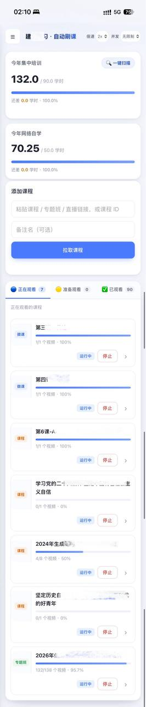

# CCB-Bot · 在线学习自动进度助手

一个可自部署的容器化工具：通过模拟正常学习的心跳上报，自动推进在线学习平台上的课程进度，支持**专题班 / 课程 / 微课**三类内容，带封面卡片、批量学习与真实进度核对。

> ⚠️ **仅供个人学习与技术研究使用。** 详见下方[免责声明](#免责声明)。

---

## 📸 界面预览

| 三类广场：专题班 / 课程 / 微课 | 主页：学时统计与运行任务 |
| :---: | :---: |
|  |  |

---

## ✨ 功能特性

- **三类学习内容**：专题班（自动报名）、课程、微课，统一的封面卡片界面。
- **自动进度**：模拟真人节奏的心跳上报，支持 1x / 2x 两档（2x 为平台可接受的安全上限）。
- **批量学习**：一键「学习前 10 节」，无需逐个点击。
- **真实进度核对**：以平台回执为准，进度未被平台确认时不会误标完成。
- **工作台三栏**：正在观看 / 准备观看 / 已观看，自动归类。
- **自托管**：Docker Compose 一键部署，数据保存在你自己的机器上。
- **凭证安全**：账号密码仅在本次登录的内存中使用，不写入配置文件、不打印日志。

## 🧱 技术栈

- 后端：Python · FastAPI · SQLAlchemy（async）· SQLite
- 登录：Playwright（独立 login-worker 容器）
- 前端：服务端渲染 + 原生 JS
- 部署：Docker · Docker Compose

---

## 🚀 快速开始（Docker 部署）

### 1. 环境要求

- 已安装 Docker 与 Docker Compose
- 一个有效的学习平台账号（账号密码）

### 2. 配置

```bash
cp .env.example .env
# 编辑 .env，按需调整参数（账号密码不强制写入，可在网页登录时手动输入）
```

`.env` 主要参数：

| 参数 | 说明 | 默认 |
| --- | --- | --- |
| `WEB_PORT` | Web 服务端口 | `8090` |
| `HEARTBEAT_MIN/MAX` | 单次心跳跨度（秒），模拟真人 | `30 / 60` |
| `CONCURRENCY` | 同时刷的视频并发数，`0`=无限制（风控敏感，建议 2–3） | `0` |
| `JITTER` | 心跳随机抖动 | `true` |

> 建议保守设置并发（2–3），节奏越接近真人越稳定。

### 3. 启动

```bash
docker compose up -d --build
```

首次启动会构建镜像并自动安装 Playwright 运行环境，需要一些时间。

### 4. 使用

1. 浏览器打开 `http://<你的服务器IP>:8090`
2. 输入学习平台账号密码登录（凭证仅本次使用）
3. 从侧边栏进入「专题班 / 课程 / 微课」，点卡片「学习」，或用「⚡ 学习前 10 节」批量开始
4. 进度在「正在观看」中实时更新；完成后进入「已观看」

### 停止 / 日志

```bash
docker compose logs -f app          # 查看日志
docker compose down                 # 停止
```

数据保存在挂载的 `data/` 目录中。

## 🔧 非 Docker（本地开发）

需要 Python 3.11+，并分别启动 `login-worker` 与 `app`：

```bash
pip install -r app/requirements.txt -r login-worker/requirements.txt
playwright install --with-deps chromium
# 终端 1
cd login-worker && uvicorn playwright_server:app --port 8000
# 终端 2
cd app && uvicorn main:app --port 8090
```

---

## 📁 目录结构

```
.
├── app/                 # FastAPI 主服务（API + 页面 + 刷课逻辑）
│   ├── services/        # 平台接口、心跳状态机、同步、调度
│   └── web/             # 模板与静态资源
├── login-worker/        # Playwright 登录服务（换票据）
├── docker-compose.yml
└── .env.example
```

## 🔐 安全与隐私

- 账号、密码只在登录请求的内存中传递，**不落盘、不打印**，服务重启即失效。
- 所有学习数据保存在你自己部署的数据库中，不经过任何第三方服务器。
- `.env` 与 `data/` 默认已在 `.gitignore` 中，不会被提交。

---

## 免责声明

1. 本项目**仅用于个人学习与技术研究目的**，旨在探索 Web 自动化、容器化与前后端工程实践。
2. 是否使用、如何使用完全是**使用者个人的自主行为**，使用者应自行了解并遵守所在单位及平台的相关规定，并自行承担一切风险与后果。
3. 作者不对任何人使用本工具所产生的任何直接或间接后果负责，包括但不限于账号异常、学习记录被清除、纪律或管理处分等。
4. 请**合理、节制**使用，不干扰平台正常运行，不利用本工具从事任何违规、违法活动。
5. 本项目与任何机构、平台**无任何关联**，亦未获得其授权或背书；文中出现的名称仅用于指代对应的技术服务。
6. 下载、构建或开始使用，即视为已阅读、理解并同意本声明的全部内容。

## License

本项目基于 [GPL-3.0](./LICENSE) 协议开源。
